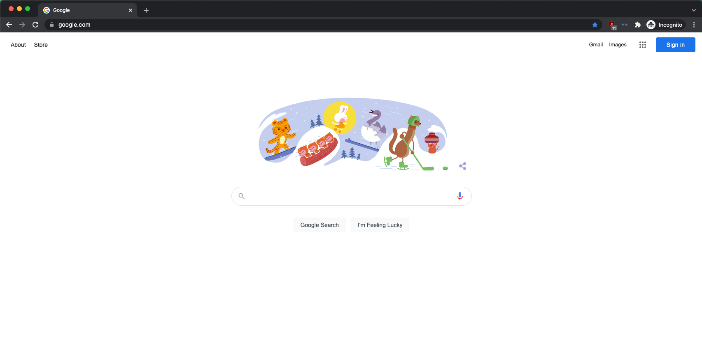
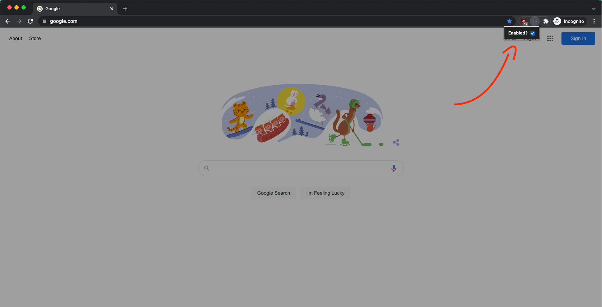

# Simple Screen Shader - Chrome Extension

## How to use
- `git clone https://github.com/davidsilva2841/simple_screen_shader.git`
- Go to Google Chrome
  - Settings > Extensions > Load unpacked
- Select folder 
  - `~/simple_screen_shader`
  

## Before

## After

